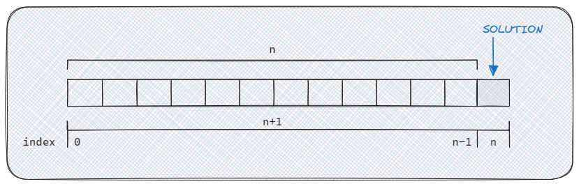

# Dynamic Programming C++

- [Dynamic Programming C++](#dynamic-programming-c)
  - [Memoization](#memoization)
  - [Tabulation](#tabulation)
- [Fibonacci](#fibonacci)
- [Grid Traveler](#grid-traveler)
- [Sum](#sum)
  - [Complexity](#complexity)
- [Construct](#construct)
  - [Complexity](#complexity-1)

---

- [ ] `#u` find the `GridTraveler` time/space complexity
- [ ] theory: focus/review time/space complexity `O()`
- [ ] `#f` debug `all_construct_xyz`
- [ ] `#u` Fib: implement memoization with `vector`

---

**Dynamic Programming** means solving a proble on a large scale by dividing it into smaller parts and applying a solving algorithm in a modular way.

> Dynamic programming is both a mathematical optimization method and an algorithmic paradigm.
> 
> In both contexts it refers to simplifying a complicated problem by breaking it down into simpler **sub-problems** in a recursive manner. While some decision problems cannot be taken apart this way, decisions that span several points in time do often break apart recursively. Likewise, in computer science, if a problem can be solved optimally by breaking it into sub-problems and then recursively finding the optimal solutions to the sub-problems, then it is said to have optimal substructure.

If sub-problems can be nested recursively inside larger problems, so that dynamic programming methods are applicable, then there is a relation between the value of the larger problem and the values of the sub-problems.

There are two main methods related to dynamic programming:

- **Memoization**: solving subproblems recursively while caching results to avoid duplicate calculations.
  - **Recursion**: *the process in which a function calls itself directly or indirectly*. Such function is called a recursive function.
- **Tabulation**:  *the process of building a table iteratively from the base cases up to the desired solution*.

Summarizing:

| Method      | Type      | Use       |
| ---         | ---       | ---       |
| Memoization | TOP-DOWN  | recursion |
| Tabulation  | BOTTOM-UP | iteration |

The implementation strategy in both cases is: think to the solution of the smallest part and find a smart way to propagate/extend it to the while system. It all depends on the identification of the **pattern**.

## Memoization

The memoization method is a *top-down* approach and solves subproblems recursively while caching results to avoid duplicate calculations.

The solution is provided for determined terminating conditions and propagates backward to compose the complete solution of the problem.


While propagating *top-bottom*, When a valid solution is found (i.e. good terminating codition) it starts propagating backward until it arrives to the beginning (top) of the problem.

## Tabulation

The tabulation method is usually *bottom-up*, meaning it starts with the smallest subproblems and builds up to the desired solution. 



The size of the target object which is to be built (e.g. an integer that is a sum, a string that is a composition of substrings) is `n`. the table can be initialized  with a length of `n` or `n+1`, depending on how the solving algorithm is structured and how many table cells it needs. The solution is then contained into `n`-th (or `n+1`-th) cell.

The table can be initialized

The solution is generated by moving a cursor along the table. There can be multiple ways to ways to generate the solution: for example, looking at the *cursor*, from a point of the table forward, or from two previous point. An implementation can be found in `Fibonacci.cpp`.


```cpp
...
    // filling forward
    for (int i=0; i < n; i++)
    {
        table[i+1] += table[i];
        table[i+2] += table[i];
    }
...
  // filling from backward
    for (int i = 2; i <= n; i++) {
        table[i] = table[i-1] + table[i-2];
    }
...
```

---

# Fibonacci

Given an integer, calculate the value of the Fibonacci sequence at the integer step:

```
    0 - 0
    1 - 0 1
    2 - 0 1 1
    3 - 0 1 1 2
    4 - 0 1 1 2 3
    5 - 0 1 1 2 3 5
    6 - 0 1 1 2 3 5 8
    7 - 0 1 1 2 3 5 8 13
    8 - ...
```

| Function | Time Complexity | Space Complexity |
| -------- | --------------- | ---------------- |
| REC      | O(2^n)          | O(n)             |
| MEMO     | O(n)            | O(n)             |
| TABLE    | O(n)            | O(n)             |

- REC 
  - Time : `O(2^n)`, in the recursion the funciton is called two times for each `n_iter < n`
  - Space: `O(n)`, the recursion stack
- MEMO
  - Time: `O(n)` the function is called only once for each `n_iter < n`
  - Space: `O(n)`, the memo size
- TABLE
  - Time: `O(n)` the function is called only once for each `n_iter < n`
  - Space: `O(n)`, the table size

---

# Grid Traveler

A traveler must traverse a grid, starting from the top-left to arrive to the bottom-right corner.
The length of the path has to be returned.

| Function | Time Complexity | Space Complexity |
| ---      | ---             | ---              |
| fib      | O()             | O()              |
| fibMem   | O()             | O()              |
| fibTab   | O()             | O()              |

# Sum

The **Sum** problem deals with the combinaton of a set of given numbers whose sum is a defined target number.

Three algorithms are implemented:

- **Can Sum**: it is returned whether a combination of numbers returning the target sum exists or not (i.e. true/false)
- **How Sum**: the first valid combination found is returned:
  - the returned combination could not be the best one, it is simply the first one found;
  - the returned combination depends on the order of the numbers to be combined, i.e. swapping the given numbers returns a different solution.
- **Best Sum**: the shortest valid combination is returned

## Complexity

| **Can Sum** | Brute Force | Memoization | Tabulation |
| -----       | ----------- | ----------- | ---------- |
| Time        | O(n ^ m)    | O(n * m)    | O(n * m)   |
| Space       | O(m)        | O(m)        | O(m)       |

| **How Sum** | Brute Force  | Memoization  | Tabulation   |
| -----       | ------------ | ------------ | ------------ |
| Time        | O(n ^ m * m) | O(n * m ^ 2) | O(m ^ 2 * n) |
| Space       | O(m)         | O(m ^ 2)     | O(m ^ 2)     |

| **Best Sum** | Brute Force  | Memoization  | Tabulation   |
| -----        | ------------ | ------------ | ------------ |
| Time         | O(n ^ m * m) | O(n * m ^ 2) | O(m ^ 2 * n) |
| Space        | O(m ^ 2)     | O(m ^ 2)     | O(m ^ 2)     |

# Construct

The **Construct** problem deals with composing a target string by combining a set of given strings.

Three algorithms are implemented:

- **Can Construct**: returns whether a combination of words returning the target word exists or not (i.e. true/false)
- **Count Construct**: returns the number of all the possibile combinations of words that compose the target word
- **All Construct**: returns all the possibile combinations of words that compose the target word

## Complexity


| **Can Construct** | Brute Force  | Memoization  | Tabulation   |
| -----             | ------------ | ------------ | ------------ |
| Time              | O(n ^ m * m) | O(n * m ^ 2) | O(m ^ 2 * n) |
| Space             | O(m ^ 2)     | O(m ^ 2)     | O(m)         |


| **Count Construct** | Brute Force  | Memoization  | Tabulation   |
| -----               | ------------ | ------------ | ------------ |
| Time                | O(n ^ m * m) | O(n * m ^ 2) | O(m ^ 2 * n) |
| Space               | O(m ^ 2)     | O(m ^ 2)     | O(m)         |

| **All Construct** | Brute Force | Memoization | Tabulation |
| -----             | ----------- | ----------- | ---------- |
| Time              | O(n ^ m)    | O(n * m)    | O(n ^ m)   |
| Space             | O(m)        | O(m)        | O(n ^ m)   |

